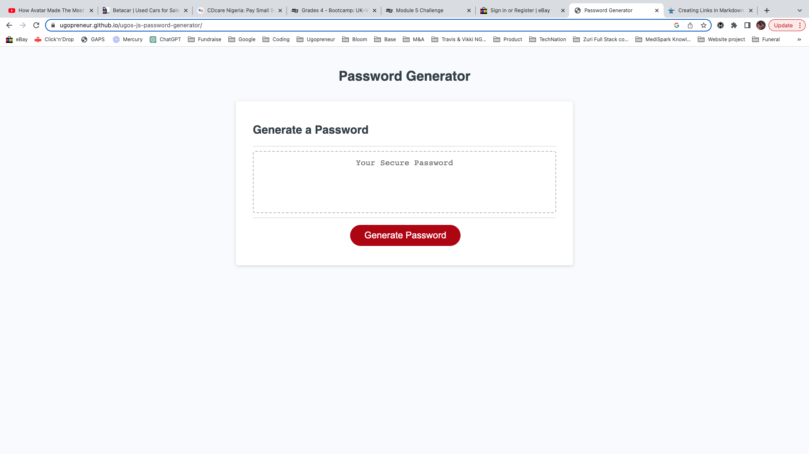

# Ugo's JS Password Generator
### A simple application to allow users generate a random password based on criteria they’ve selected

## Table of Contents

- [Overview](#overview)
- [Usage](#usage)
- [Built With](#built-with)
- [Contact](#contact)
- [Acknowledgements](#acknowledgements)

## Overview

The goal was to try and apply my newly learned Javascript skills (Iterating over arrays, writing for loops, working with different variable scopes, nested loops and nested functions, prompts, if/else statements, methods and more) in developing a simple password generator for use in a real-world situation. 

Hence, I built a web page that, first, asks the use a few password building options, then takes the user's choices and generates a password that fits the user's requirememnts - with all logic written completely in javascript.

  

## Usage

1. Click [here](https://ugopreneur.github.io/ugos-js-password-generator/) to open my Password Generator web page
2. Click the red 'Generate Password' button
3. Enter the number of password characters neede into the prompt field provided
4. Indicate whether you would need special characters, numbers, lowercase letters or upper case letters by responding to the next 4 prompts
5. View your automatically gereated password in the "Your secure password" box

## Built With

- Basic HTML to load the web page and write generated password to the browser view
- CSS for styling with media queries put in for varying screen sizes
- Intermediate-level Javascript for all logic: Arrays, Variables, methods, For Loops, nested for loops, Functions, nested functions, prompts, if/else statements, Manipulating HTML DOM etc.

See acknowledgments at bottom of page or click [here](#acknowledgements) 

## Contact

- Email: ugnwokoro@yahoo.com
- Twitter: https://twitter.com/ugopreneur
- LinkedIn: https://www.linkedin.com/in/ugonwokoro/ 
- Dev.to: https://dev.to/ugopreneur 

## Acknowledgements

A few sources i must give credit for helping me build this:

- The usual tips and resources from W3Schools, Mozilla.org and Stack Overflow
- My good friend Gbenga Oyeniyi
- chatGPT for guidance when i was lost